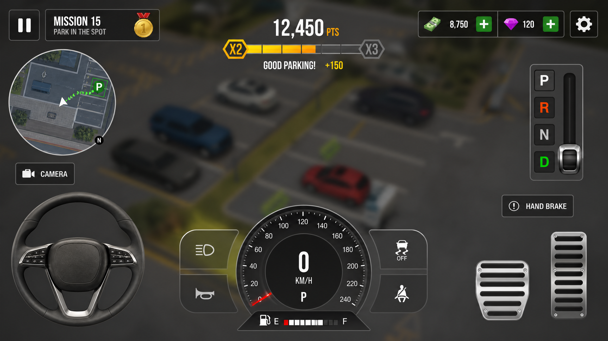

# Car Parking Simulator


A university game programming assignment focusing on a high-precision, mechanics-driven driving architecture for a car parking simulation experience.


## Project Overview


This project implements a "Car Parking Simulator" as a university assignment. The core objective is to develop a game that emphasizes realistic driving physics, precise vehicle control, and spatial awareness within various parking scenarios. The game is built using the Unity Engine and C#.


## Gameplay Screenshots


*Description: Beginner course in the driving school scenario, featuring cone navigation and basic parking.*


*Description: Advanced parking challenge in a multi-level urban concrete garage.*


*Description: High-stakes logistics parking in an industrial port area during sunset.*




*Description: Detailed view of the gameplay HUD, including speedometer, mini-map, and scoring system.*


## Features


*   **Realistic Vehicle Physics:** Implementing accurate car handling, braking, and acceleration.
*   
*   **Diverse Environments:** Multiple acts simulating different parking challenges (e.g., driving school, urban valet, industrial logistics).
*   
*   **Career Progression:** A structured three-phase career mode with increasing difficulty.
*   
*   **Vehicle Customization:** Options for upgrading vehicle performance and aesthetics.
*   
*   **Scoring System:** Rewarding players based on parking precision, speed, and minimal damage.
*   


## Repository Structure


This repository is organized to reflect the development sprints and key project assets:


```

CarParkingSimulator/

│

├── Assets/                  # Unity project assets (models, textures, prefabs, etc.)

├── Docs/                    # Project documentation (reports, installation guide, design docs)

├── Scripts/                 # Core C# scripts for game logic

├── Sprint1_Modeling/        # Documentation and assets related to 3D modeling sprint

├── Sprint2_Texturing/       # Documentation and assets related to texturing sprint

├── Sprint3_Importing/       # Documentation and assets related to asset importing sprint

├── Sprint4_LevelDesign/     # Documentation and assets related to level design sprint

├── Sprint5_Scripting/       # Documentation and assets related to scripting sprint

├── Sprint6_Rendering/       # Documentation and assets related to rendering and post-processing sprint

├── README.md                # This file

├── LICENSE                  # Project license information

└── .gitignore               # Git ignore rules for Unity projects

```


## Installation Guide


Refer to the `Docs/Installation Guide.md` for detailed instructions on setting up and running the project.


## Project Report


A comprehensive `Docs/Project Report.md` is available, detailing the project's design, implementation, challenges, and outcomes, suitable for academic submission.


## Development Sprints


Each sprint folder contains specific details, progress, and relevant assets for that development phase. Please refer to the individual `README.md` files within each sprint folder for more information.


## Contributing


This repository is primarily for academic submission. For any inquiries, please contact the project authors.


## License


This project is licensed under the MIT License. See the `LICENSE` file for details.


